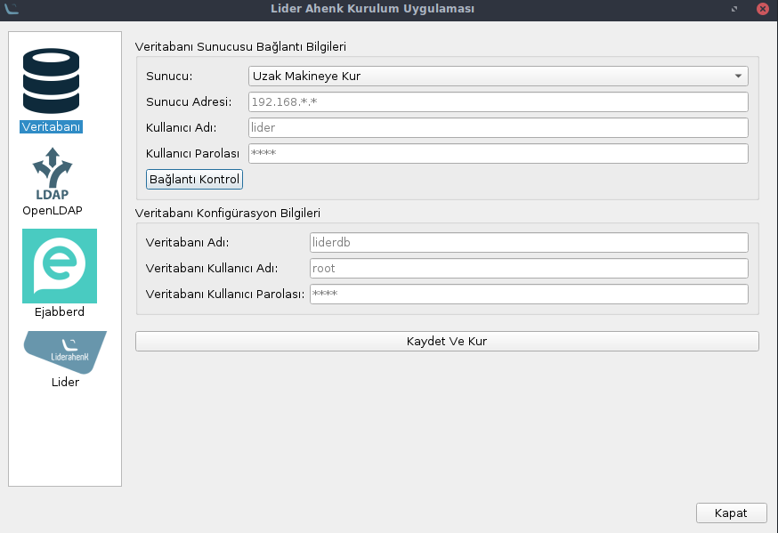

# lider-ahenk-installer

* How to install

1) First install dependencies;

***sudo apt-get install python3-yaml python3-paramiko python3-pyqt5***

***sudo apt-get install python3-pip***

***pip3 install ruamel.yaml***

(http://yaml.readthedocs.io/en/latest/overview.html)

2) git clone project

***sudo apt-get install git***

***git clone https://github.com/Pardus-LiderAhenk/lider-ahenk-installer.git***

* How to use

Application is started with ***python3 app.py*** command under the src directory

